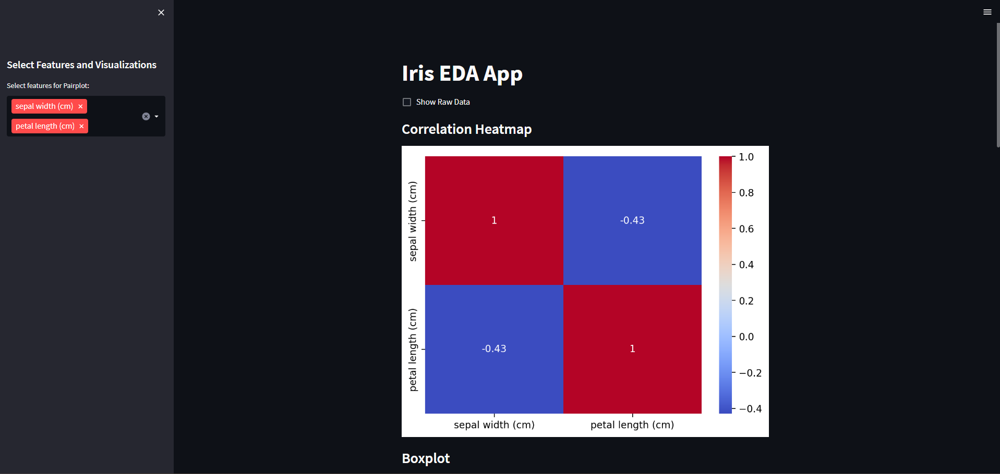

# Iris EDA App

## Overview

This is a simple web application built with Streamlit that demonstrates a basic machine learning model using the famous Iris dataset. The app allows users to input the sepal length, sepal width, petal length, and petal width of an iris flower and predicts its species using a pre-trained model.



## Features

- Input fields for sepal length, sepal width, petal length, and petal width.
- Predicts the species of the iris flower based on the input features.
- Displays the predicted species along with confidence scores.

## Getting Started

To run the web app locally, follow these steps:

1. Clone the repository:

   ```bash
   git clone https://github.com/your-username/EDA-App.git
   cd EDA-App
   cd eda_app

2. To run the app, pls enter this in your bash, after following Step 1.
   
   ```bash
   streamlit run app.py
